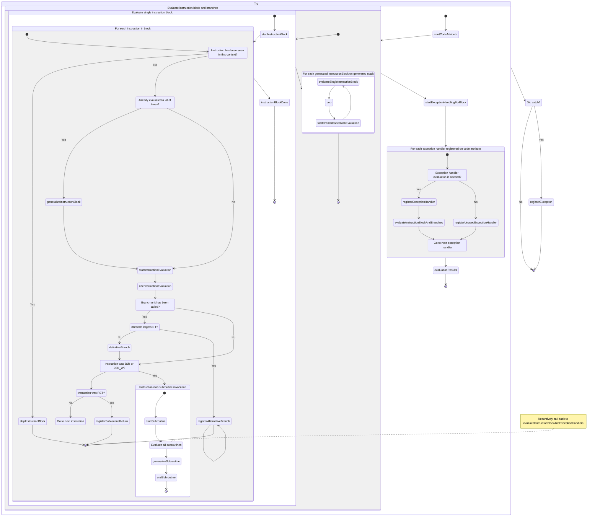

## Analyzing all instructions {: instructions}

If you want to analyze bytecode, you'll probably want to visit specified
instructions of specified code attributes of specified methods of specified
classes. The visitor classes and filters quickly get you to the right place:

    :::java
    programClassPool.classesAccept(
        new AllMethodVisitor(
        new AllAttributeVisitor(
        new AllInstructionVisitor(
        new MyInstructionAnalyzer()))));

You then only need to implement the visitor methods to analyze the
instructions:

    :::java
    class      MyInstructionAnalyzer
    implements InstructionVisitor
    {
        public void visitSimpleInstruction(Clazz clazz, .....) ...
        public void visitVariableInstruction(Clazz clazz, .....) ...
        public void visitConstantInstruction(Clazz clazz, .....) ...
        public void visitBranchInstruction(Clazz clazz, .....) ...
        public void visitTableSwitchInstruction(Clazz clazz, .....) ...
        public void visitLookUpSwitchInstruction(Clazz clazz, .....) ...
    }

The library already provides classes to analyze the code for you, finding
branching information, performing partial evaluation, finding the control flow
and data flow, etc, as introduced in the following sections.

Complete example: EvaluateReturnValues.java

## Collecting basic branching information {: #branching}

You can extract basic information about branches in a method with the class
BranchTargetFinder. The results are defined at the instruction level: each
instruction is properly labeled as a branch target, branch origin, exception
handler, etc.

    :::java
    BranchTargetFinder branchTargetFinder =
        new BranchTargetFinder();

    branchTargetFinder.visitCodeAttribute(clazz, method, codeAttribute);

    if (branchTargetFinder.isBranchOrigin(offset)) ...

    if (branchTargetFinder.isBranchTarget(offset)) ...

Complete example: ApplyPeepholeOptimizations.java

## Partial evaluation

You can extract more information about the code with partial evaluation (often
called abstract evaluation or symbolic evaluation). Its analysis provides a
global view of the control flow and data flow in a method.

The core class is PartialEvaluator. It can work at different levels of
precision &mdash; the more abstract, the less precise. You can control the
precision with different value factories and different invocation units:

- A ValueFactory defines the level of detail in representing values like
  integers or reference types. The values can be very abstract (any primitive
  integer, a reference to any object) or more precise (the integer 42, or an
  integer between 0 and 5, or a non-null reference to an instance of
  java/lang/String).

- An InvocationUnit defines the values returned from retrieved fields and
  invoked methods. The values can again be very generic (any integer) or they
  can also be values that were cached in prior evaluations of the code base.

Complete example: EvaluateCode.java, which provides options to analyze code
with different levels of precision. It prints out its results in markdown
format, which is also used in the examples below.

### Control flow analysis

You can set up basic evaluation with a BasicValueFactory and
a BasicInvocationUnit:

    :::java
    ValueFactory     valueFactory     = new BasicValueFactory();
    InvocationUnit   invocationUnit   = new BasicInvocationUnit(valueFactory);
    PartialEvaluator partialEvaluator = new PartialEvaluator(valueFactory,
                                                             invocationUnit,
                                                             false);

The analysis provides a control flow graph of the instructions in a method.
Each instruction is labeled with potential branch targets and branch origins:

    :::java
    InstructionOffsetValue branchOrigins = partialEvaluator.branchOrigins(offset));
    InstructionOffsetValue branchTargets = partialEvaluator.branchTargets(offset));

Complete example: VisualizeControlFlow.java

### Data flow analysis

You can also inspect the data flow between the instructions in a method by
looking at the stack and the local variables:

    :::java
    TracedStack     stack     = partialEvaluator.getStackAfter(offset);
    TracedVariables variables = partialEvaluator.getVariablesAfter(offset);

Consider the following code:

    :::java
    public static int getAnswer()
    {
        int f1 = 6;
        int f2 = 7;

        return f1 * f2;
    }

Applying the above partial evaluator to this code yields this overall result:

Instruction | Stack | v0 |  v1 |
------------|-------|----|----|
[0] bipush 6 | [0:i]  | empty | empty |
[2] istore_0 v0 |  | 2:i | empty |
[3] bipush 7 | [3:i]  | 2:i | empty |
[5] istore_1 v1 |  | 2:i | 5:i |
[6] iload_0 v0 | [6:i]  | 2:i | 5:i |
[7] iload_1 v1 | [6:i] [7:i]  | 2:i | 5:i |
[8] imul | [8:i]  | 2:i | 5:i |
[9] ireturn |  | 2:i | 5:i |

Each integer value followed by a colon indicates the offset of the instruction
that stored or pushed the value. Each 'i' indicates an unknown primitive
integer value.

Useful applications: dependency analysis at an instruction level, for example
to remove unused instructions.

Complete example: EvaluateCode.java

## More precise numerical evaluation {: #numerical}

The above basic evaluation doesn't tell you much about any numerical results.
You can set up more precise numerical evaluation with a
ParticularValueFactory:

    :::java
    ValueFactory     valueFactory     = new ParticularValueFactory(new BasicValueFactory());
    InvocationUnit   invocationUnit   = new BasicInvocationUnit(valueFactory);
    PartialEvaluator partialEvaluator = new PartialEvaluator(valueFactory,
                                                             invocationUnit,
                                                             false);

For the same code as in the previous section:

Instruction | Stack | v0 |  v1 |
------------|-------|----|----|
[0] bipush 6 | [0:6]  | empty | empty |
[2] istore_0 v0 |  | 2:6 | empty |
[3] bipush 7 | [3:7]  | 2:6 | empty |
[5] istore_1 v1 |  | 2:6 | 5:7 |
[6] iload_0 v0 | [6:6]  | 2:6 | 5:7 |
[7] iload_1 v1 | [6:6] [7:7]  | 2:6 | 5:7 |
[8] imul | [8:42]  | 2:6 | 5:7 |
[9] ireturn |  | 2:6 | 5:7 |

In this trivial example, the previously unknown integers are now all concrete
values. The last instruction pops the computed result 42 from the stack and
returns it.

Useful application: constant propagation.

## Evaluation with numeric ranges {: #range}

Consider the following code:

    :::java
    public static int getAnswer()
    {
        int answer = 0;
        for (int counter = 0; counter < 3 && Math.random() < 0.5f; counter++)
        {
            answer += 14;
        }

        return answer;
    }

The possible answer isn't a single value. You can let the evaluation work with
integer ranges with a RangeValueFactory:

    :::java
    ValueFactory     valueFactory     = new RangeValueFactory(new ArrayReferenceValueFactory(), new BasicValueFactory());
    InvocationUnit   invocationUnit   = new BasicInvocationUnit(valueFactory);
    PartialEvaluator partialEvaluator = new PartialEvaluator(valueFactory,
                                                             invocationUnit,
                                                             false);

The overall result of the analysis of the sample method is:

Instruction | Stack | v0 | v1 |
------------|-------|----|----|
[0] iconst_0 | [0:0]  | empty | empty |
[1] istore_0 v0 |  | 1:0 | empty |
[2] iconst_0 | [2:0]  | 1:0 | empty |
[3] istore_1 v1 |  | 1:0 | 3:0 |
[4] iload_1 v1 | [4:0..3]  | 1,19:0..42 | 3,22:0..3 |
[5] iconst_3 | [4:0..3] [5:3]  | 1,19:0..42 | 3,22:0..3 |
[6] if_icmpge +22 (target=28) |  | 1,19:0..42 | 3,22:0..3 |
[9] invokestatic #2 | [9:T] [9:d]  | 1,19:0..28 | 3,22:0..2 |
[12] ldc2_w #3 | [9:T] [9:d] [12:T] [12:0.5d]  | 1,19:0..28 | 3,22:0..2 |
[15] dcmpg | [15:i]  | 1,19:0..28 | 3,22:0..2 |
[16] ifge +12 (target=28) |  | 1,19:0..28 | 3,22:0..2 |
[19] iinc v0, 14 |  | 19:14..42 | 3,22:0..2 |
[22] iinc v1, 1 |  | 19:14..42 | 22:1..3 |
[25] goto -21 (target=4) |  | 19:14..42 | 22:1..3 |
[28] iload_0 v0 | [28:0..42]  | 1,19:0..42 | 3,22:0..3 |
[29] ireturn |  | 1,19:0..42 | 3,22:0..3 |

Not all values are entirely concrete; they can have a range (with ".."). The
method can return a value between 0 and 42.

Useful applications: simplification of range checks.

## Symbolic numerical evaluation {: #symbolic}

Consider the following code:

    :::java
    private static int getAnswer(int a, int b)
    {
        return 2 * a + b;
    }

The numerical evaluation of the previous sections doesn't get you very far,
since the parameters are unknown, so all computations produce unknown values:

Instruction | Stack | v0 |  v1 |
------------|-------|----|----|
[0] iconst_2 | [0:2]  | P0:i | P1:i |
[1] iload_0 v0 | [0:2] [1:i]  | P0:i | P1:i |
[2] imul | [2:i]  | P0:i | P1:i |
[3] iload_1 v1 | [2:i] [3:i]  | P0:i | P1:i |
[4] iadd | [4:i]  | P0:i | P1:i |
[5] ireturn |  | P0:i | P1:i |

You can set up symbolic evaluation with an IdentifiedValueFactory:

    :::java
    ValueFactory     valueFactory     = new IdentifiedValueFactory();
    InvocationUnit   invocationUnit   = new BasicInvocationUnit(valueFactory);
    PartialEvaluator partialEvaluator = new PartialEvaluator(valueFactory,
                                                             invocationUnit,
                                                             false);

The overall result of the analysis of the sample method is:

Instruction | Stack | v0 |  v1 |
------------|-------|----|----|
[0] iconst_2 | [0:2]  | P0:i0 | P1:i1 |
[1] iload_0 v0 | [0:2] [1:i0]  | P0:i0 | P1:i1 |
[2] imul | [2:(2*i0)]  | P0:i0 | P1:i1 |
[3] iload_1 v1 | [2:(2*i0)] [3:i1]  | P0:i0 | P1:i1 |
[4] iadd | [4:((2*i0)+i1)]  | P0:i0 | P1:i1 |
[5] ireturn |  | P0:i0 | P1:i1 |

The unknown values now have symbolic names (IDs): "i0" and "i1". Any
computations result in symbolic expressions, such as "((2*i0)+i1)".

Useful applications: a basis for symbolic simplification, static single
assignment, further analysis with SMT solvers (satisfiability modulo
theories).

## Evaluation with reference types {: #tracing}

The previous sections only showed examples with primitive types. Consider the following code with reference types:

    :::java
    public static Number getAnswer(Number answer)
    {
        if (answer == null)
        {
            answer = new Integer(42);
        }

        return answer;
    }

The basic or numeric evaluation of the previuous sections don't tell much
about the non-primitive types:

Instruction | Stack | v0 |
------------|-------|----|
[0] aload_0 v0 | [0:a]  | P0:a |
[1] ifnonnull +13 (target=14) |  | P0:a |
[4] new #2 | [4:a]  | P0:a |
[7] dup | [4:7:a] [4:7:a]  | P0:a |
[8] bipush 42 | [4:7:a] [4:7:a] [8:42]  | P0:a |
[10] invokespecial #3 | [4:7:a]  | P0:a |
[13] astore_0 v0 |  | 13:a |
[14] aload_0 v0 | [14:a]  | P0,13:a |
[15] areturn |  | P0,13:a |

Unknown reference types are shown as "a".

You can keep track of origins of references in more detail with a
ReferenceTracingValueFactory and a ReferenceTracingInvocationUnit. The
PartialEvaluator is set up slightly differently from the earlier examples:

    :::java
    ReferenceTracingValueFactory valueFactory     = new ReferenceTracingValueFactory(new BasicValueFactory()) :
    InvocationUnit               invocationUnit   = new ReferenceTracingInvocationUnit(new BasicInvocationUnit(valueFactory));
    PartialEvaluator             partialEvaluator = new PartialEvaluator(valueFactory,
                                                                         invocationUnit,
                                                                         false,
                                                                         valueFactory);

The results then show the origins of non-primitive types:

Instruction | Stack | v0 |
------------|-------|----|
[0] aload_0 v0 | [0:P0:a]  | P0:P0:a |
[1] ifnonnull +13 (target=14) |  | P0:P0:a |
[4] new #2 | [4:N4:a]  | P0:P0:a |
[7] dup | [4:7:N4:a] [4:7:N4:a]  | P0:P0:a |
[8] bipush 42 | [4:7:N4:a] [4:7:N4:a] [8:i]  | P0:P0:a |
[10] invokespecial #3 | [4:7:N4:a]  | P0:P0:a |
[13] astore_0 v0 |  | 13:N4:a |
[14] aload_0 v0 | [14:N4,P0:a]  | P0,13:N4,P0:a |
[15] areturn |  | P0,13:N4,P0:a |

For example, the method pops and returns either a new instance ("N4") that
was created at offset 4, or parameter 0 ("P0").

Useful applications: define/use analysis, a basis for escape analysis or taint
analysis.

## Evaluation with more precise reference types {: #typed}

You can keep track of non-primitive types in more detail with a
TypedReferenceValueFactory:

    :::java
    ValueFactory     valueFactory     = new TypedReferenceValueFactory();
    InvocationUnit   invocationUnit   = new BasicInvocationUnit(valueFactory);
    PartialEvaluator partialEvaluator = new PartialEvaluator(valueFactory,
                                                             invocationUnit,
                                                             false);

The results then show the types:

Instruction | Stack | v0 |
------------|-------|----|
[0] aload_0 v0 | [0:Ljava/lang/Number;]  | P0:Ljava/lang/Number; |
[1] ifnonnull +13 (target=14) |  | P0:Ljava/lang/Number; |
[4] new #2 | [4:Ljava/lang/Integer;=!]  | P0:Ljava/lang/Number; |
[7] dup | [4:7:Ljava/lang/Integer;=!] [4:7:Ljava/lang/Integer;=!]  | P0:Ljava/lang/Number; |
[8] bipush 42 | [4:7:Ljava/lang/Integer;=!] [4:7:Ljava/lang/Integer;=!] [8:i]  | P0:Ljava/lang/Number; |
[10] invokespecial #3 | [4:7:Ljava/lang/Integer;=!]  | P0:Ljava/lang/Number; |
[13] astore_0 v0 |  | 13:Ljava/lang/Integer;=! |
[14] aload_0 v0 | [14:Ljava/lang/Number;]  | P0,13:Ljava/lang/Number; |
[15] areturn |  | P0,13:Ljava/lang/Number; |

The types here are "Ljava/lang/Number;" and "Ljava/lang/Integer;". The types
respect the type hierarchy, for example when the branches join and the type is
"Ljava/lang/Number;". A mark "=" means that the type is the exact type, not an
extension. A mark "!" means that the value is definitely not null.

Useful applications: preverification of the type safety of bytecode.

### Note on type variables naming convention
PGC has different representation for type string variables:

- External class name: `com.guardsquare.SomeClass`
- Internal class name: `com/guardsquare/SomeClass`
- Internal type (or just `type`): `Lcom/guardsquare/SomeClass;` (for arrays e.g. `[I`, `[Ljava/lang/Object;`)
- Internal class type: `com/guardsquare/SomeClass` (for arrays this is their internal type e.g. `[I`, `[Ljava/lang/Object;`)

See `proguard.classfile.util.ClassUtil` for useful methods to convert between the different representations.

## Evaluation with primitive arrays {: #array}

Primitive arrays may be of special interest, for example when performing
optimizations.

Consider the following code:

    :::java
    public static int getAnswer()
    {
        int[] array = new int[] { 6, 7 };

        return array[0] * array[1];
    }

Even though this is a trivial example, the previous evaluations
wouldn't provide much useful information:

Instruction | Stack | v0 |
------------|-------|----|
[0] iconst_2 | [0:i]  | empty |
[1] newarray 10 | [1:[I?=![i]]  | empty |
[3] dup | [1:3:[I?=![i]] [1:3:[I?=![i]]  | empty |
[4] iconst_0 | [1:3:[I?=![i]] [1:3:[I?=![i]] [4:i]  | empty |
[5] bipush 6 | [1:3:[I?=![i]] [1:3:[I?=![i]] [4:i] [5:i]  | empty |
[7] iastore | [1:3:[I?=![i]]  | empty |
[8] dup | [1:8:[I?=![i]] [1:8:[I?=![i]]  | empty |
[9] iconst_1 | [1:8:[I?=![i]] [1:8:[I?=![i]] [9:i]  | empty |
[10] bipush 7 | [1:8:[I?=![i]] [1:8:[I?=![i]] [9:i] [10:i]  | empty |
[12] iastore | [1:8:[I?=![i]]  | empty |
[13] astore_0 v0 |  | 13:[I?=![i] |
[14] aload_0 v0 | [14:[I?=![i]]  | 13:[I?=![i] |
[15] iconst_0 | [14:[I?=![i]] [15:i]  | 13:[I?=![i] |
[16] iaload | [16:i]  | 13:[I?=![i] |
[17] aload_0 v0 | [16:i] [17:[I?=![i]]  | 13:[I?=![i] |
[18] iconst_1 | [16:i] [17:[I?=![i]] [18:i]  | 13:[I?=![i] |
[19] iaload | [16:i] [19:i]  | 13:[I?=![i] |
[20] imul | [20:i]  | 13:[I?=![i] |
[21] ireturn |  | 13:[I?=![i] |

The array type is "[I", which is the standard notation for an array of
primitive integers.

You can keep track of the lengths of arrays with ArrayReferenceValueFactory
and even of the contents of primitive arrays with
DetailedArrayValueFactory:

    :::java
    ValueFactory     valueFactory     = new DetailedArrayValueFactory();
    InvocationUnit   invocationUnit   = new BasicInvocationUnit(valueFactory);
    PartialEvaluator partialEvaluator = new PartialEvaluator(valueFactory,
                                                             invocationUnit,
                                                             false);

The results of the evaluation then become:

Instruction | Stack | v0 |
------------|-------|----|
[0] iconst_2 | [0:2]  | empty |
[1] newarray 10 | [1:[I?=![2]#0{6,7}]  | empty |
[3] dup | [1:3:[I?=![2]#0{6,7}] [1:3:[I?=![2]#0{6,7}]  | empty |
[4] iconst_0 | [1:3:[I?=![2]#0{6,7}] [1:3:[I?=![2]#0{6,7}] [4:0]  | empty |
[5] bipush 6 | [1:3:[I?=![2]#0{6,7}] [1:3:[I?=![2]#0{6,7}] [4:0] [5:6]  | empty |
[7] iastore | [1:3:[I?=![2]#0{6,7}]  | empty |
[8] dup | [1:8:[I?=![2]#0{6,7}] [1:8:[I?=![2]#0{6,7}]  | empty |
[9] iconst_1 | [1:8:[I?=![2]#0{6,7}] [1:8:[I?=![2]#0{6,7}] [9:1]  | empty |
[10] bipush 7 | [1:8:[I?=![2]#0{6,7}] [1:8:[I?=![2]#0{6,7}] [9:1] [10:7]  | empty |
[12] iastore | [1:8:[I?=![2]#0{6,7}]  | empty |
[13] astore_0 v0 |  | 13:[I?=![2]#0{6,7} |
[14] aload_0 v0 | [14:[I?=![2]#0{6,7}]  | 13:[I?=![2]#0{6,7} |
[15] iconst_0 | [14:[I?=![2]#0{6,7}] [15:0]  | 13:[I?=![2]#0{6,7} |
[16] iaload | [16:6]  | 13:[I?=![2]#0{6,7} |
[17] aload_0 v0 | [16:6] [17:[I?=![2]#0{6,7}]  | 13:[I?=![2]#0{6,7} |
[18] iconst_1 | [16:6] [17:[I?=![2]#0{6,7}] [18:1]  | 13:[I?=![2]#0{6,7} |
[19] iaload | [16:6] [19:7]  | 13:[I?=![2]#0{6,7} |
[20] imul | [20:42]  | 13:[I?=![2]#0{6,7} |
[21] ireturn |  | 13:[I?=![2]#0{6,7} |

The array is now traced as having length 2 and elements 6 and 7.

Useful application: simplification of code with enum types.

## Evaluation with particular reference values {: #particularreference}

The values of references can also be of interest.

Consider the following code:

    :::java
    public StringBuilder append()
    {
        StringBuilder s = new StringBuilder("asd");
        s.append("fgh");
        return s;
    }

If the value of `s` is of interest, this can be retrieved using a `ParticularValueFactory`. To also keep track of the references as they flow through method calls (in the example: the constructor-call, and the `append`), the InvocationUnit needs to be a `ExecutingInvocationUnit`:

    :::java
    ValueFactory            valueFactory     = new ParticularValueFactory(new BasicValueFactory(), 
                                                                          new ParticularValueFactory.ReferenceValueFactory());
    ExecutingInvocationUnit invocationUnit   = new ExecutingInvocationUnit(valueFactory);
    PartialEvaluator        partialEvaluator = new PartialEvaluator(valueFactory, 
                                                                    invocationUnit, 
                                                                    false);

The results of the evaluation then become:

Instruction | Stack (before the Instruction) | v0 (before the Instruction) |
------------|-------|----|
[0] new StringBuilder    |   | [empty:empty]
[3] dup |  [0:StringBuilder=!#0] | [empty:empty]
[4] ldc "asd"    |  [3:0:StringBuilder=!#0] [3:0:StringBuilder=!#0] | [empty:empty]
[6] invokespecial StringBuilder.&lt;init&gt;(String)V  |  [4:String?=#1(asd)] [3:0:StringBuilder=!#0] [3:0:StringBuilder=!#0] | [empty:empty]
[9] astore_0 v0 |  [3:0:StringBuilder=#2(asd)] | [empty:empty]
[10] aload_0 v0 |   | [9:StringBuilder=#2(asd)]
[11] ldc "fgh"    |  [10:StringBuilder=#2(asd)] | [9:StringBuilder=#2(asd)]
[13] invokevirtual StringBuilder.append(String)StringBuilder  |  [11:String?=#3(fgh)] [10:StringBuilder=#2(asd)] | [9:StringBuilder=#2(asd)]
[16] pop    |  [13:StringBuilder=#4(asdfgh)] | [13:StringBuilder=#4(asdfgh)]
[17] aload_0 v0 |   | [13:StringBuilder=#4(asdfgh)]
[18] areturn    |  [17:StringBuilder=#4(asdfgh)] | [13:StringBuilder=#4(asdfgh)]

(Class/String constants are added to the instruction, and `java/lang/` is ommited from the class names for clarity)

The `StringBuilder` is now traced through the method, the value of the reference can be retrieved before and after each location. The value of the reference is printed in this output in the finishing brackets. The notation before the bracket is the notation of a `TypedReference` ([TypedReference](#typed))

### Limitations

- Only `String`, `StringBuilder`, and `StringBuffer` are currently supported.
- The `ParticularValueFactory` keeps track of one specific value of a reference. If more values would be possible (e.g., due to a branch), the result will be an `UnknownReferenceValue`

## Lifecycle

The lifecycle can be tracked by providing a `PartialEvaluatorStateTracker` to the partial evaluator through its builder.
For example, when you want to get a JSON debug output regarding the evaluations made by the partial evaluator, you can do so by:

    :::java
    JsonPrinter tracker = new JsonPrinter();
    PartialEvaluator partialEvaluator = PartialEvaluator.Builder.create().setStateTracker(tracker).build()

